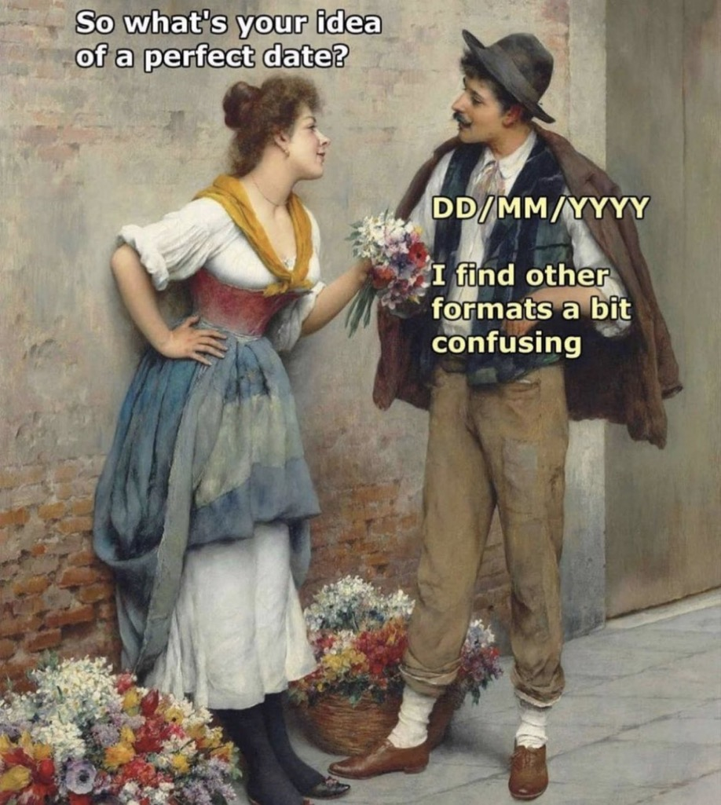



## Outline

::: incremental
1.  Introduction and course overview
2.  Reproducibility and human error
3.  Introduction to R/RStudio
4.  AI policy
:::

# Introduction

## Course overview

**Objectives & Approach**

-   Hands-on data exploration and visualization

-   A mix of lessons and exercises on basic analysis

-   Learning one tool for all tasks: **R**

## Your job

::: incremental
-   **Explore.**
-   Work together.
-   Ask questions.
-   Do the exercises.
-   Work with your own data.
:::

# Reproducibility and human error

## Spreadsheets

::: {style="display: flex; justify-content: center; gap: 20px; height: 60vh;"}

:::

::: incremental
> Spreadsheets are ubiquitous, but they come with hidden risks in scientific research.
:::

## Auto-'correct'

{fig-align="center" width="40%"}

## Auto-'correct' gone wrong

::::: columns
::: {.column width="60%"}
**Example 1:**

-   Excel converted human genes and protein names to dates
-   Still used and causing errors in published research
:::

::: {.column width="30%"}
{style="margin-top: -90px;" fig-align="right" style="margin-right: 30%"}
:::
:::::

## Why not Excel?

::::: columns
::: {.column width="60%"}
**Example 2 — The Reinhart-Rogoff error**

-   Claimed average real economic growth **increases** when debt \> 90% of GDP
-   Mistakenly excluding 5 data points flipped the conclusion to a **0.1% decline**
-   A spreadsheet formula error; reviewed by thousands before discovery

> Errors in spreadsheets are invisible as you cannot audit a click.
:::

::: {.column width="30%"}
{style="margin-top: -90px;" fig-align="right" style="margin-right: 30%"}
:::
:::::

## King of spreadsheets

{fig-align="center" width="30%"}

# Introduction to R/RStudio

## Better tools are available

{style="margin-top: -90px;" fig-align="right" style="margin-right: 30%"}

> Using a better tool produces **reproducible**, **auditable**, **sharable** work.

## Use R

::::: columns
::: {.column width="50%"}
Five steps for today:

1.  Install [R](https://cran.r-project.org/)
2.  Install [RStudio](https://posit.co/products/open-source/rstudio)
3.  Create a [new project](https://docs.posit.co/ide/user/ide/get-started/#hello-rstudio-projects) for "WILD541"
4.  Create a [new R script](https://docs.posit.co/ide/user/ide/get-started/#hello-rstudio-projects) for today's class `Day01.R`
5.  [Use R](https://rstudio.github.io/cheatsheets/html/rstudio-ide.html#tab-panes) for basic operations


:::

::: {.column width="30%"}
{style="margin-top: 105px;"}
:::
:::::

## Some R benefits

::: incremental
-   Environment for statistical computing **and** graphics
-   **Free** (open-source)
-   Used by many researchers worldwide
-   Good documentation and community
-   Continuously updated and expanded
-   Can reuse existing scripts
-   **Runs the same each time** ← this is reproducibility
:::

## Overview

{width="90%" fig-align="center"}

## Use R as a calculator

You can use R for simple and complex calculations using mathematical operators:

```{webr}
# R as a calculator
(35 + 55 * 10) / sqrt(99)
```

::: callout-tip
You can use a hash mark `#` to include comments, e.g., ”R as a calculator” in the above code. Any text after `#` is ignored by R. Comment liberally: it helps you remember and others understand your code.
:::

## Use R for summaries

You can use R built-in functions, e.g., summary(), to find summary statistics.

```{webr}
# Create a sequence of numbers
x <- 1:15

# Display basic statistical measures
summary(x)
```

> So, the mean of these data is 8.

## Cite R

```{webr}
# Find the citation for R itself
citation()
```

```{webr}
# Find your R version
R.version
```

::: callout-tip
Citing software used in your analysis is good scientific practice.

Likewise, if you ever have a question about what version of R you are using, you could type the above in the R prompt and find the details.
:::

# Generative AI

## AI for coding

{fig-align="center"}

[The elephant in the room](https://en.wikipedia.org/wiki/Elephant_in_the_room)

> Per university guidelines, use of [generative artificial intelligence](https://libguides.lib.umt.edu/ai) is **not** prohibited. However, instructors set the terms for their course.

## Course AI policy

| Task | Status | Notes |
|------------------------|------------------------|------------------------|
| Understanding concepts, debugging error messages, learning a package | [🟢 Encouraged]{.chip .go} | No disclosure needed for incidental use |
| Boilerplate & scaffolding (plot themes, cleaning templates) | [🟢 Allowed]{.chip .go} | Note it in a code comment |
| Choosing a model or test, study-design decisions | [🟡 Case-by-case]{.chip .wait} | AI can help you brainstorm; the justification must be yours |
| Writing a full analysis script or its interpretation | [🔴 Not permitted]{.chip .stop} | This is the competency being graded |
| Exams & independent problem sets | [🔴 Not permitted]{.chip .stop} | Unless the assignment says otherwise |

## Step 1: Understand Before You Prompt

::: incremental
-   Know your question and your data **before** you open the chat window.

-   Separate two different jobs: deciding *what the analysis should do* (your job) from *typing the syntax* (AI can help with this job).

-   Use AI to learn field conventions and relevant tools, not only to generate the final answer.

-   Sanity check: could you defend this line of code to your committee?
:::

::: callout-warning
Watch out for [vibe coding](https://arxiv.org/html/2510.22254v1): accepting AI output you cannot **evaluate**, **debug**, or **explain** yourself.
:::

## Step 2: Choose Your Tool

| Tool | Best for |
|------------------------------------|------------------------------------|
| Conversational (Claude, ChatGPT) | Architecture questions, debugging, learning a new package |
| IDE assistant (Copilot-style) | Autocompletion, staying in flow |
| Autonomous agent (Claude Code, Cursor) | Multi-file edits, rapid prototyping |

::: callout-important
-   Check university guidelines for [approved AI tools](https://umontana.ai/guidelines/approved-tools/)
-   Check AI [model comparisons](https://umontana.ai/guidelines/model-comparison)
-   Restate key constraints in long sessions as most tools don't remember perfectly
-   Commit working code before a big AI-driven change, so you can always roll back
:::

## Step 3: Test Everything, Trust Nothing

::: incremental
-   Ask for tests before or during implementation.

-   Verify the test outputs.

-   Verify the results against something you understand, e.g., a plot or summary statistics.
:::

::: callout-note
Despite AI doesn’t know your data, i.e., if samples are paired, clustered, or spatially autocorrelated unless you tell it, it will still confidently hand you a test.

If the code ran without errors, it does *not* mean it is correct.
:::

## Step 4: You Are Still the Scientist

::: incremental
-   The responsibility for AI-assisted code **always** belongs to the person who submits it.

-   *“The AI wrote it”* is not a defense for a mis-specified model, or results nobody else can reproduce.
:::

::: callout-important
Rule of thumb: **if you can’t explain a line at your defense, don’t turn it in**
:::

## Privacy & data sharing

::: incremental
-   Never paste into a public AI tool: unpublished results, embargoed or data subject to data-sharing agreement.

-   Data from Tribal lands, communities, or partnerships: additional authorization applies, regardless of a public tool’s terms of service

-   Precise locations of sensitive, threatened, or poaching-vulnerable species are often legally restricted and the coordinates should be treated as any other confidential data.

-   When unsure: troubleshoot with a simulated or anonymized subset, and ask before uploading anything real
:::

::: callout-important
If you can’t anonymize data meaningfully, don’t paste it into a public AI tool.
:::

## Disclosure and citation are mandatory

Every university policy agrees on disclosing AI use.

In code, use a header comment as below:

```{webr}
# Debugging help from Claude (Anthropic), 5 Jul 2026:
# fixed a factor-level mismatch in the random-effects term below
model <- lmer(mass ~ treatment + (1 | site), data = df)
```

> In a report, one sentence is enough. For the above example, you could write: "I used Claude (Anthropic) to debug syntax errors in my mixed-model code; model specification and interpretation are my own."

## Do vs Don't

::: incremental
✔ Ask it to explain an error or an unfamiliar function

✔ Use it to learn a new package syntax

✔ Get a first draft of code structure

✔ Brainstorm modeling approaches, then justify your own choice

✔ Ask it to generate edge cases you might miss

✘ Submit code you can’t explain line by line

✘ Let it pick your statistical test without knowing why

✘ Paste/import unpublished data or sensitive coordinates into a public tool

✘ Skip verifying AI-cited functions or references

✘ Treat “it ran without error” as proof it’s correct
:::
