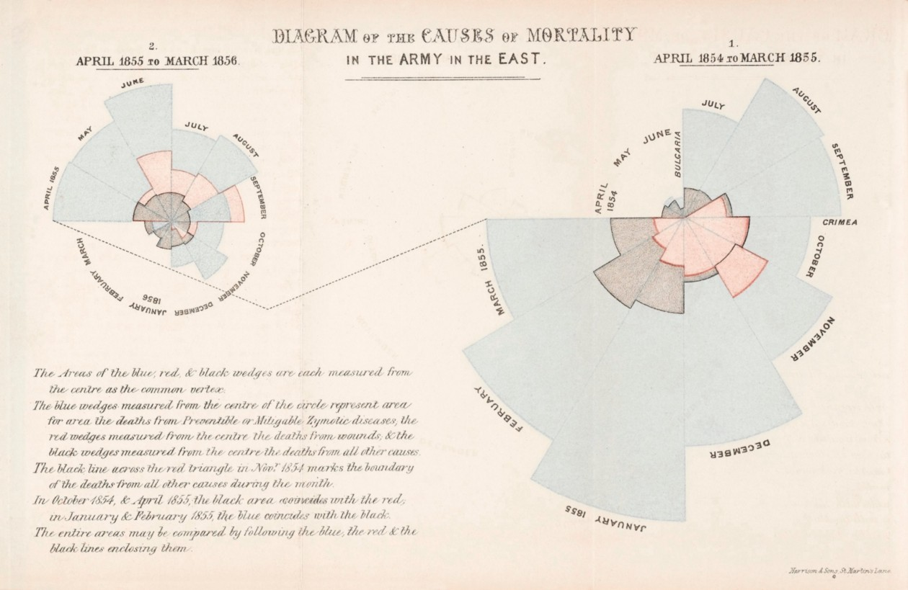
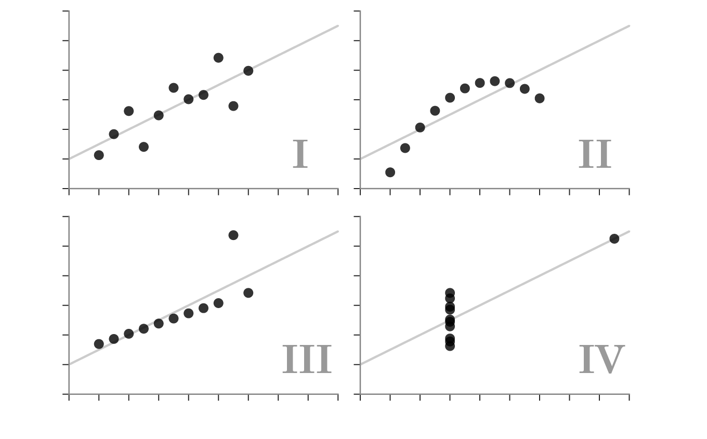
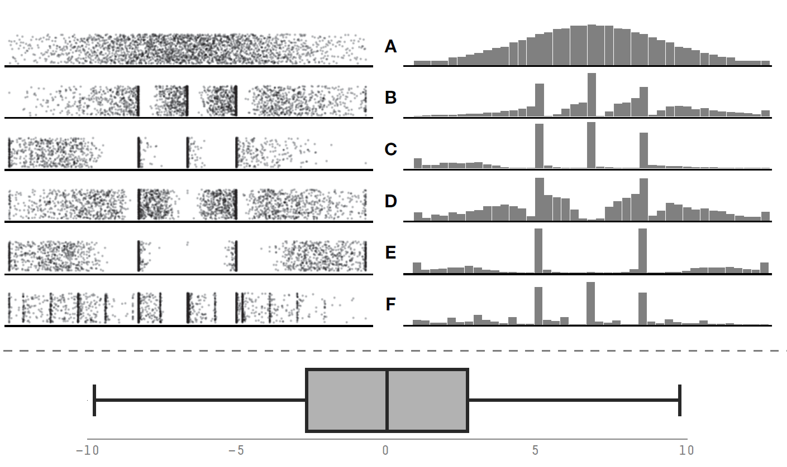



## Outline

1.  Why do we visualize?
2.  What to visualize?
3.  How to visualize?
4.  Practice
5.  Generating a report: R Markdown

# Why do we visualize?

## A picture is worth a thousand words



[The Nightingale rose diagram](https://en.wikipedia.org/wiki/Florence_Nightingale)

## Anscombe's Quartet

::: callout-note
Each dataset has the same summary statistics (mean, standard deviation, correlation), and the datasets are clearly different, and visually distinct.
:::



## Overview

Graphics are an important tool for conveying information. Good figures can raise a scientific article and make its contents accessible to a larger audience.

Here you will learn the basics of producing **publication-quality graphs** with R.

# What to visualize?

## Choose the right visualization

{width="90%"}

## Setup: load data

If you saved ".RData" in your RStudio project folder last week, you can load it as below. It's a good practice to start by emptying the workspace and then loading the data.

```{webr}
rm(list = ls())            # Clear workspace
load("snapshot_usa.RData") # Load data

```

Otherwise, you can load the original ".csv":

```{webr}
rm(list = ls())  # Clear workspace

library(utils)   # Load required R package

# Specify data path
url_remote <- "https://raw.githubusercontent.com/"
path_git   <- "MTourani/WILD541_F2026/refs/heads/main/"

# Load data
snapshot_usa <- utils::read.csv(paste0(url_remote, path_git, "snapshot_usa.csv"))

```

```{=html}
<!-- 
::: {.callout-note}
The `snapshot_usa.csv` dataset has grown since this lecture was written (~60 500 rows now vs. ~14 300 in class). This is a live example of the reproducibility challenge discussed in Lesson 1!
:::
-->
```

## Data preparation: new column

Let's add a column so that every row has a unique ID.

```{webr}
# Add unique row ID
snapshot_usa$ID <- seq_len(nrow(snapshot_usa))
```

Next, let's extract the week number and add it as a new column to the existing table:

```{webr}
# Extract numeric week number (handles "2019-W35" format)
snapshot_usa$Week <- as.integer(sub(".*-W(\\d+).*",
                                    "\\1",
                                    snapshot_usa$Week,
                                    perl = TRUE)
)

# Inspect the table
head(snapshot_usa)
```

## Data preparation: subset

As you learned in the previous class, we can use conditions to subset data. For example, we could ask how many mammal species were recorded at least once.

```{webr}
mammal_snapshot <- snapshot_usa[snapshot_usa$Class == "Mammals", ]
# Number of mammal species
length(unique(mammal_snapshot$Species_Name))

# Number of days with at least one photo

# Number of deployment locations with at least one photo

```

> How many survey days have at least one photo? How many deployment locations?

## Data preparation: aggregate

Let’s aggregate and find the number of observations per animal class or species.

```{webr}
# How many observations per animal class?
aggregate(ID ~ Class,
          data = snapshot_usa,
          FUN  = function(x)length(unique(x)))

```

> Can you find the species with the most number of detection locations?

```{webr}
# How many detection locations per species?
aggregate(Deployment_ID ~ Species_Name,
          data = snapshot_usa,
          FUN = function(x)length(unique(x)))

```

## Data preparation: aggregate

```{webr}
# Observations per week
tab1 <- aggregate(ID ~ Week,
                  data = snapshot_usa,
                  FUN  = function(x) length(unique(x)))

# Per species per week
tab2 <- aggregate(ID ~ Common_Name + Week,
                  data = snapshot_usa,
                  FUN  = function(x) length(unique(x)))

# Per class per week
tab3 <- aggregate(ID ~ Class + Week,
                  data = snapshot_usa,
                  FUN  = function(x) length(unique(x)))
```

# How to visualize?

## Simple plot

The plot() function is the basic function for generating plots in R.

```{webr}
plot(snapshot_usa$ID ~ snapshot_usa$Week)
```

> The formula y∼x indicates to plot() that time (week) should be plotted on the x-axis as a function of the number of IDs on the y-axis.

## Simple plot

We could also use aggregated tables for plotting to make more sense of the data.

```{webr}
plot(tab1$ID ~ tab1$Week)
```

## Customize a plot

Within the plot() function, you have a lot of options to customize the graph. See the examples below.

```{webr}
plot(tab1$ID ~ tab1$Week,
     xlab  = "Week",
     ylab  = "Number of photos",
     type  = "l",
     lty   = 2,
     col   = "grey",
     axes  = FALSE,
     xlim  = c(min(tab1$Week) - 1, max(tab1$Week) + 1),
     ylim  = c(min(tab1$ID)  - 30, max(tab1$ID)  + 200),
     lwd   = 2, 
     xaxs  = "i", 
     yaxs  = "i", 
     frame = FALSE)
```

## Customizing the axes

The default axes produced by plot() are often appropriate, but sometimes we want to have more control over the axes, including their position and scale. To create custom axes, set the axes argument in the plot() function to FALSE and then execute a separate axis() function for each axis.

```{webr}
plot(tab1$ID ~ tab1$Week,
     type  = "l",
     lty   = 2,
     col   = "grey", 
     axes  = FALSE,
     xlim  = c(min(tab1$Week) - 1, max(tab1$Week) + 1),
     ylim  = c(min(tab1$ID) - 30,  max(tab1$ID) + 200),
     lwd   = 2,
     xaxs  = "i", 
     yaxs  = "i",
     frame = FALSE,
     xlab  = "Week",
     ylab  = "Number of photos")
 
axis(1,
     at    = seq(min(tab1$Week) - 1, max(tab1$Week) + 1, 2),
     label = seq(min(tab1$Week) - 1, max(tab1$Week) + 1, 2),
     las   = 1,
     lwd   = 2)
```

> Which axis was just added to the plot?

## Customizing the axes

Similarly, add the second axis as shown below.

```{webr}
plot(tab1$ID ~ tab1$Week,
     type  = "l",
     lty   = 2,
     col   = "grey", 
     axes  = FALSE,
     xlim  = c(min(tab1$Week) - 1, max(tab1$Week) + 1),
     ylim  = c(0, max(tab1$ID) + 200),
     lwd   = 2,
     xaxs  = "i", 
     yaxs  = "i", 
     frame = FALSE,
     xlab  = "Week",
     ylab  = "Number of photos")

axis(1,
     at = seq(min(tab1$Week) - 1, max(tab1$Week) + 1, 2),
     label = seq(min(tab1$Week) - 1, max(tab1$Week) + 1, 2),
     las = 1, 
     lwd = 2)
axis(2,
     at = seq(0, max(tab1$ID), 200),
     label = seq(0, max(tab1$ID), 200), 
     las = 1, lwd = 2)

```

## Customizing the plot

Finally, add the points to the already existing plot.

```{webr}
plot(tab1$ID ~ tab1$Week,
     type  = "l",
     lty   = 2,
     col   = "grey", 
     axes  = FALSE,
     xlim  = c(min(tab1$Week) - 1, max(tab1$Week) + 1),
     ylim  = c(0, max(tab1$ID) + 200),
     lwd   = 2,
     xaxs  = "i", 
     yaxs  = "i", 
     frame = FALSE,
     xlab  = "Week",
     ylab  = "Number of photos")

axis(1,
     at = seq(min(tab1$Week) - 1, max(tab1$Week) + 1, 2),
     label = seq(min(tab1$Week) - 1, max(tab1$Week) + 1, 2),
     las = 1, 
     lwd = 2)
axis(2,
     at = seq(0, max(tab1$ID), 200),
     label = seq(0, max(tab1$ID), 200), 
     las = 1, lwd = 2)

points(tab1$ID ~ tab1$Week, pch = 21, bg = "firebrick", cex = 1.1)
```

## Conveying additional information

We can use plots for a graphical comparison between two groups. For example, we can plot the number of bird observations vs mammals’. We first plot the number of mammal records per survey week, and then add to the existing plot the number of bird records.

```{webr}
tab3_mammals <- tab3[tab3$Class == "Mammals", ]
tab3_aves    <- tab3[tab3$Class == "Aves",    ]

plot(tab3_mammals$ID ~ tab3_mammals$Week,
     col  = "orange",
     lwd  = 3,
     pch  = 19,
     xlab = "Week",
     ylab = "Number of photos",
     main = "")

```

## Conveying additional information

You can enrich the data part of your graphs by adding additional features such as colors, text, etc. This allows you to convey more information than just the usual 2 dimensions.

```{webr}
plot(tab3_mammals$ID ~ tab3_mammals$Week,
     col  = "orange",
     lwd  = 3,
     pch  = 19,
     xlab = "Week",
     ylab = "Number of photos",
     main = "")

points(tab3_aves$ID ~ tab3_aves$Week,
       pch = 17,
       col = "lightblue", 
       lwd = 3)

legend("topright",
       legend = c("Aves", "Mammals"),
       lwd    = 3, 
       pch    = c(17, 19),
       col    = c("lightblue", "orange"))
```

## Barplot

Let’s use a barplot to display the number of records for canids.

```{webr}
canid_index <- c("Coyote",
                 "Domestic Dog",
                 "Red Fox",
                 "Gray Fox",
                 "Gray Wolf",
                 "Kit Fox",
                 "Red Wolf")
canid_snapshot <- mammal_snapshot[mammal_snapshot$Common_Name %in% canid_index, ]
mx <- table(canid_snapshot$Common_Name)

barplot(height    = mx,
        xlab      = "Canid species",
        ylab      = "Number of photos",
        names.arg = names(mx),
        density   = seq(10, 70, 10),
        col       = "firebrick")
```

## Stacked barplot

How about the number of records per week for bears?

```{webr}
bear_index <- c("Ursus arctos", "Ursus americanus")
bear <- mammal_snapshot[mammal_snapshot$Species_Name %in% bear_index, ]
mx   <- table(bear$Species_Name, bear$Week)

barplot(height    = mx, 
        width     = 10,
        xlab      = "Week",
        ylab      = "Number of photos",
        names.arg = colnames(mx),
        beside    = TRUE,
        density   = c(20, 50), 
        col       = "black")
legend(210,
       100,
       legend  = unique(bear$Species_Name),
       density = c(20, 50),
       bty     = "n", 
       title   = "")
```

## Add text labels to a plot

You can add text (e.g., point labels) inside a plot. Let’s plot the weekly number of records per species (tab2) and flag the species with the most weekly records. One approach is to first use order() and see which species have over 1000 detections per week.

```{webr}
tab4 <- tab2[order(tab2$ID, decreasing = TRUE), ]

plot(tab4$ID ~ tab4$Week,
     xlab = "Week",
     ylab = "Number of photos",
     ylim = c(0, max(tab4$ID) + 120))

text(tab4$ID[1:9] ~ tab4$Week[1:9],
     labels = tab4$Common_Name[1:9],
     pos    = 1, 
     cex    = 0.7)

# Highlight top records in colour
points(tab4$ID[1:9] ~ tab4$Week[1:9], col = "turquoise")
```

> In the above plot, we have flagged the highest number of weekly records by adding the species name. Now, can you use colors to flag these points?

## Customizing the plot

Let’s filter tab2 and keep canids and display the number of weekly records per canid species. You can pick one color for each input type from the color scale provided by function topo.colors().

```{webr}
tab5     <- tab2[tab2$Common_Name %in% canid_index, ]
my_cols  <- topo.colors(length(unique(tab5$Common_Name)))
names(my_cols) <- unique(tab5$Common_Name)

plot(ID ~ Week, 
     data = tab5,
     ylab = "Number of photos",
     xlab = "Week",
     xlim = c(min(tab5$Week) - 1, max(tab5$Week) + 3),
     pch = 19,
     col = my_cols[Common_Name],
     cex = 1.3, 
     main = "")

legend("topright",
       legend = unique(tab5$Common_Name),
       pch    = 19,
       cex    = 1, 
       pt.cex = 1.5, 
       col    = my_cols)
```

## Multiple panels

Often, we display multiple graphs in multiple panels as part of the same figure. You can use the par() function to split your display into panels. In the previous table, let’s filter foxes and make one plot per fox species.

```{webr}
tab6     <- tab5[grep("Fox", tab5$Common_Name), ]
my_cols  <- c("darkorange", "grey", "lightblue")
names(my_cols) <- unique(tab6$Common_Name)

par(mfrow = c(1, 3))
for (i in seq_along(unique(tab6$Common_Name))) {
  this_fox <- unique(tab6$Common_Name)[i]
  plot(ID ~ Week,
       data = tab6[tab6$Common_Name == this_fox, ],
       ylab = "Number of photos",
       xlab = "Week",
       xlim = c(min(tab6$Week) - 1, max(tab6$Week) + 3),
       ylim = c(0, max(tab6$ID) + 3),
       pch = 19, 
       cex = 1.3,
       col = my_cols[Common_Name],
       type = "h",
       lend = 1, 
       lwd = 5,
       main = this_fox)
}
par(mfrow = c(1,1))
```

## Plot device

```{webr}
windows(4,4)
plot(ID ~ Week,
     data = tab6[tab6$Common_Name == "Red Fox",],
     ylab = "Number of photos",
     xlab = "Week",
     xlim = c(min(tab6$Week) - 1, max(tab6$Week) + 3),
     ylim = c(0, max(tab6$ID) + 3),
     pch  = 19,
     col  = my_cols[Common_Name],
     cex  = 1.3, 
     type = "h",
     lend = 1,
     lwd = 5,
     main = this_fox
)
```

::: {.callout-tip title="tip"}
You can open a new plot window, outside of R, with the windows() function. This can be helpful if you want to have multiple plots open simultaneously for comparison or if you want to see what your plot looks like given a certain size and aspect ratio.
:::

## Plot device

We want to make it easy for the viewer to pick out the important relationships or differences in our figure. Aside from the features mentioned earlier in this lesson, you can control the appearance of a plot and thus the emphasis on its characteristics by changing the scaling of the axes and their aspect ratio. To see how important the choice of aspect can be, run the following code and then resize the plot window by stretching it out horizontally.

```{webr}
x <- seq(1, 100, 0.5)
y <- sin(x)
windows(5, 3)
plot(y ~ x)
```

## Exporting figures

Although RStudio will allow you to save figures from the interface, exporting figures with dedicated functions will give you full control over size, resolution and other attributes. This is the way we tend to create figures for scientific articles and presentations. First, we run one of the figure export functions (e.g., tiff() to export a figure in TIF/tiff format). Here we specify the attributes of the figure.

```{webr}
tiff(filename = "myplot.tif", width = 10, height = 7, units = "cm", res = 300)

par(mfrow = c(1, 3))
for (i in seq_along(unique(tab6$Common_Name))) {
  this_fox <- unique(tab6$Common_Name)[i]
  plot(ID ~ Week,
       data = tab6[tab6$Common_Name == this_fox, ],
       ylab = "Number of photos",
       xlab = "Week",
       xlim = c(min(tab6$Week) - 1, max(tab6$Week) + 3),
       ylim = c(0, max(tab6$ID) + 3),
       pch = 19,
       cex = 1.3,
       type = "h", 
       lend = 1, 
       lwd = 5,
       col = my_cols[Common_Name], 
       main = this_fox)
}

dev.off()
```

::: {.callout-tip title="tip"}
We close the plotting device using dev.off(), which finalizes and saves the image file. The resulting figure will not show up in R.
:::

# Practice

## Your turn

::: {.callout-tip title="Practice"}
Using your own data, create at least **5 plots** that demonstrate:

a.  Displaying additional information via colors, symbol shapes, and sizes
b.  Adding more data to an existing plot
c.  Combining several plots in multi-panel figures
d.  Exporting figures to various file formats
:::

# Generating a report: R Markdown

## What is R Markdown?

R Markdown lets you weave together code, output, and narrative text into a single reproducible document. Check out the [cheatsheet](https://rmarkdown.rstudio.com/lesson-15.HTML).

::::: columns
::: {.column width="50%"}

:::

::: {.column width="50%"}

:::
:::::
