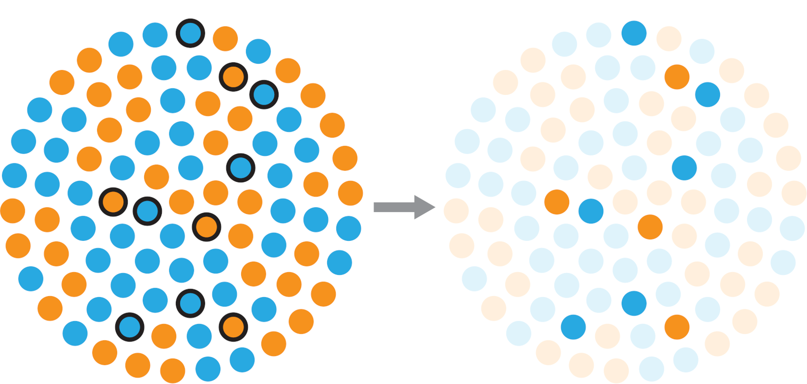



## Outline

1.  Random sampling
2.  Simulating data
3.  Data distributions
4.  Practice

# Random sampling

## What is randomness?

::::: columns
::: {.column width="60%"}
-   Equal and independent chance of being selected.
-   We cannot predict the outcome of a particular roll with certainty — this is a **random** (stochastic) process.
:::

::: {.column width="25%"}

:::
:::::

> Can you draw 30 random points?\
> Humans are surprisingly bad at generating truly random sequences. That's why we use algorithms.

## Why do we sample?



## Terminology

::::: rows
::: {.row height="80%"}
-   **Event**
-   **Set**\
-   **Outcome**
-   **Trial**\
-   **Experiment**
:::

::: {.row height="20%"}

:::
:::::

## Measuring probability

> What is the probability of trout being captured by an osprey?

::: incremental
-   The **event** is a predator attack.

-   An attack has 2 **outcomes**: escape or capture.

-   These outcomes are discrete.

-   The set {**(escape)**, **(capture)**} consisting of all the possibles outcomes is called the **sample space**.

-   We are interested in the outcome **«capture»**.

-   Each attack is also called a **trial**.

-   A set of trials is an **experiment**.
:::

# Simulation

## Simulating data

One way to understand distributions is to **generate and inspect simulated data**.

Simulated data from a known distribution can also be compared with real data to identify which distribution the data came from.

Here you will learn how to simulate data from common theoretical distributions, as well as how to visualize and compare them.

# Data distributions

## Uniform distribution

Let's start with 100 draws from a uniform distribution between 0 and 10.

```{webr}
x_unif <- runif(n = 100, min = 0, max = 10)
```

We can summarize the resulting data:

```{webr}
summary(x_unif)
```

... and plot the raw data in the order in which the samples were drawn:

```{webr}
plot(x_unif, type = "h")
```

> Compare your simulated data with your neighbor. Did you generate the same values?

## Uniform distribution

You can use set.seed() to make your simulation reproducible.

```{webr}
set.seed(2026)
x_unif <- runif(n = 100, min = 0, max = 10)
summary(x_unif)
plot(x_unif, type = "h")
```

> Compare your simulated data with your neighbor. Did you generate the same values?

## Uniform distribution

We can generate a histogram to visualize the distribution of these simulated data:

```{webr}
set.seed(2026)
x_unif <- runif(n = 100, min = 0, max = 10)
hist(x_unif)
```

## Your turn

::: {.callout-tip title="Practice 1"}
Repeat the uniform sampling for sample sizes: **50, 250, 500, and 5000**.

Plot all 4 histograms in a multi-panel figure. How does the shape change with increasing sample size?

*(Hint: use `par(mfrow = ...)` and a `for` loop.)*
:::

```{webr}
set.seed(2026)
par(mfrow = c(2, 2))
for (n in c(50, 250, 500, 5000)) {
  x <- runif(n = n, min = 0, max = 10)
  hist(x, main = paste("n =", n), xlab = "Value")
}
par(mfrow = c(1,1))
```

## Normal distribution

We can draw samples from a normal distribution using function rnorm(). We provide the number of samples to be drawn, the mean, and the standard deviation.

```{webr}
x_norm <- rnorm(n = 100, mean = 0, sd = 1)
summary(x_norm)
plot(x_norm, type = "h")
```

> Are the sample mean and standard deviation identical to the specified values?

## Visualization

The previous plot gives us an idea about the spread (apparently symmetrical around 0) and order (random) of values, but it is not a great way to discern their distribution. There are different ways to visualize the distribution. We can, for example, use a histogram:

```{webr}
set.seed(2026)
x_norm <- rnorm(n = 100, mean = 0, sd = 1)
hist(x_norm)
```

or a Kernel density plot, with vertical lines added for the mean and 95% confidence interval:

```{webr}
set.seed(2026)
x_norm <- rnorm(n = 100, mean = 0, sd = 1)
plot(density(x_norm))
abline(v = mean(x_norm), lwd = 2, col = "red")
ci <- quantile(x_norm, probs = c(0.025, 0.975))
abline(v = ci, col = "red", lty = 2)
```

## Visualization

We can also plot a Kernel density on top of the histogram:

```{webr}
set.seed(2026)
x_norm <- rnorm(n = 100, mean = 0, sd = 1)
hist(x_norm, probability = TRUE)
lines(density(x_norm), col = "red", lwd = 4)
```

::: callout-note
Here we display the probability, instead of the frequency of falling into a bin of values. This allows us to compare the histogram and density kernel in the same plot.
:::

## Visualization

We can compare two distributions by plotting their Kernel densities in the same graph:

```{webr}
set.seed(2026)
x1_norm <- rnorm(1000, mean = 25, sd = 5)
x2_norm <- rnorm(1000, mean = 15, sd = 2)

plot(density(x1_norm), col = "red",  lwd = 4, ylim = c(0, 0.30))
lines(density(x2_norm), col = "blue", lwd = 4)
```

or by plotting them as box-and-whisker plots:

```{webr}
set.seed(2026)
x1_norm <- rnorm(1000, mean = 25, sd = 5)
x2_norm <- rnorm(1000, mean = 15, sd = 2)

data1  <- data.frame(x = x1_norm, sample = "A")
data2  <- data.frame(x = x2_norm, sample = "B")
my_data <- rbind(data1, data2)

boxplot(x ~ sample, data = my_data)
```

## Poisson distribution

Count data are often assumed to follow a Poisson distribution. You can simulate count data using the rpois() function. As you recall the normal distribution has two parameters, the mean and the standard deviation. The Poisson function only has one parameter, the mean count λ (lambda). Here is an example of how to generate and display Poisson data:

```{webr}
x_pois <- rpois(n = 250, lambda = 3.3)
hist(x_pois, probability = TRUE)
```

## Poisson distribution

Here too, we can compare the distribution of different samples in the same plot:

```{webr}
x1_pois <- rpois(250, lambda = 3.3)
x2_pois <- rpois(250, lambda = 1.5)
max_count <- max(c(x1_pois, x2_pois))

hist(x1_pois,
     probability = TRUE,
     breaks = 0 : max_count,
     ylim = c(0, 0.8),
     xlab = "x",
     main = "")
hist(x2_pois,
     add = TRUE, 
     probability = TRUE,
     col = adjustcolor("blue", 0.25),
     border = "blue",
     breaks = 0 : max_count)
```

## Your turn

::: {.callout-tip title="Practice 2"}
Generate a figure showing histograms of **3 different draws** from a Poisson distribution in a single multi-panel figure. Use different values of lambda for simulating the 3 datasets.
:::

```{webr}
par(mfrow = c(1, 3))
for (m in c(1, 5, 15)) {
  x <- rpois(250, lambda = m)
  hist(x, main = paste("λ =", m), xlab = "Count", probability = TRUE)
}
par(mfrow = c(1,1))
```

## Binomial distribution

The binomial distribution results from a process whereby repeated trials lead to either success or failure. In R, we can use the rbinom() function, which takes as arguments the sample size (number of observations), the number of trials per observation, and the probability of success in a given trial. In the following example, we draw 10 samples from a Binomial distribution based on 5 trials and a 0.25 probability of success:

```{webr}
x_binom <- rbinom(n = 10, size = 5, prob = 0.25)

```

> The output gives the number of successes (out of 5 trials) for each of the 10 samples we drew.

## Bernoulli distribution

The Bernoulli distribution is a special case of the Binomial distribution where each observation consists of only a **single trial**. For example, we can draw 10 samples from a Bernoulli distribution using the rbinom() function like this:

```{webr}
# e.g., flipping a coin with P(heads) = 0.35
x_bern <- rbinom(n = 10, size = 1, prob = 0.35)
```

> This is essentially the same as tossing a coin 10 times. In this example, the probability of getting heads (“success”) instead of tails (“failure”) is 0.35.

One way to display the distribution of the resulting data is as a bar plot of the tabulated results, showing the frequency of a success vs. failure:

```{webr}
barplot(table(x_bern == 1),
        xlab = "Outcome",
        ylab = "Number of cases")
```

## Your turn

::: {.callout-tip title="Practice 3"}
Using **your own data**:

1.  Visualize the distribution of continuous and/or count variables in your data. Use different types of displays, such as density plots, histograms, and box-and-whisker plots. You may have to select portions of your data, as different subsets may originate from different distributions (e.g., adult vs. juvenile body weights).

2.  Use simulations (with parameters from your real data) to compare whether your data resemble a theoretical distribution (uniform, normal, Poisson, etc.). Do this by plotting the simulated distributions over the empirical distributions. Example distributions to compare your data with are the uniform, the normal, and the Poisson distribution. But feel free to look up and try other distributions as well.
:::
